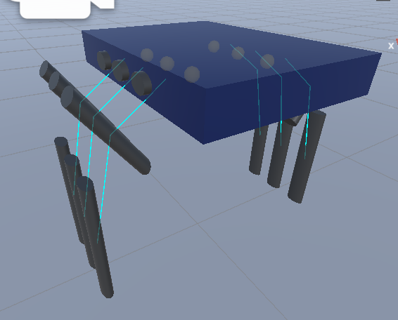
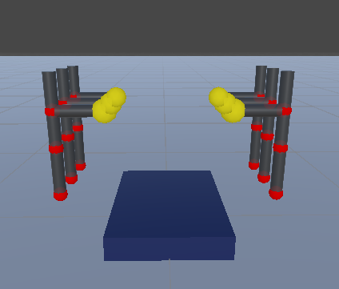
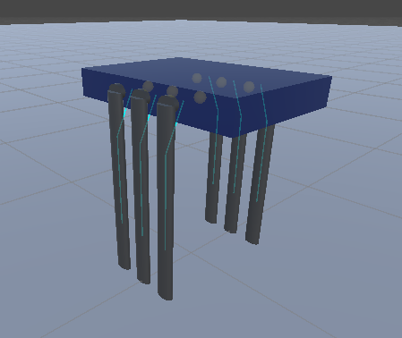

# 🦗 Hexapod Robot Simulation in Unity

<div align="center">
  

  
[](https://unity.com/)
[](LICENSE)
[]()
[](http://makeapullrequest.com)
  
*A realistic six-legged robot simulation with biomimetic locomotion and inverse kinematics*
</div>

## 📋 Overview

This project implements a fully-functional hexapod (six-legged) robot simulation in Unity, inspired by insect locomotion. The simulation features a procedurally generated robot model with realistic leg movement powered by analytical inverse kinematics (IK). The hexapod can walk using three different biologically-inspired gait patterns and adapt to different terrains.

<div align="center">
  
<table>
  <tr>
    <td align="center"><br/><sub><b>Tripod Gait</b></sub></td>
    <td align="center"><br/><sub><b>Wave Gait</b></sub></td>
    <td align="center"><br/><sub><b>Ripple Gait</b></sub></td>
  </tr>
</table>
</div>

## ✨ Features

- <span style="color:#007bff">**Procedural Model Generation**</span>: Fully customizable hexapod body and leg dimensions
- <span style="color:#6f42c1">**Inverse Kinematics System**</span>: Analytical IK solution for natural leg movement
- <span style="color:#28a745">**Multiple Gait Patterns**</span>: Tripod, Wave, and Ripple gaits inspired by insect locomotion
- <span style="color:#fd7e14">**Terrain Adaptation**</span>: Ground detection and foot placement adjustment
- <span style="color:#e83e8c">**Smooth Controls**</span>: Intuitive movement with acceleration and turning
- <span style="color:#20c997">**Camera System**</span>: Multiple viewing options (third-person, top-down, first-person)
- <span style="color:#dc3545">**Physics Integration**</span>: Real-time movement with proper joint rotation

## 🚀 Installation

1. Clone this repository

   ```bash
   git clone https://github.com/yourusername/hexapod-simulation.git
   ```

2. Open the project in Unity 2020.3 or later

   ```
   Unity Hub → Add → Select the cloned folder
   ```

3. Open the `HexapodScene` from the Scenes folder

4. Press Play to start the simulation

## 🎮 Controls

| Key         | Action                               |
| ----------- | ------------------------------------ |
| W / ↑       | Move forward                         |
| S / ↓       | Move backward                        |
| A / ←       | Turn left                            |
| D / →       | Turn right                           |
| 1           | Switch to Tripod Gait                |
| 2           | Switch to Wave Gait                  |
| 3           | Switch to Ripple Gait                |
| C           | Cycle camera views                   |
| Right Click | Rotate camera (in third-person view) |
| Space       | Toggle debug visualization           |
| Esc         | Reset simulation                     |

## 🧩 Project Structure

```
Assets/
├── Prefabs/
│   └── Hexapod.prefab
├── Scenes/
│   └── HexapodScene.unity
├── Scripts/
│   ├── HexapodGenerator.cs    # Procedural model generation
│   ├── HexapodLeg.cs          # Individual leg IK and movement
│   ├── HexapodController.cs   # Overall movement and gait control
│   └── HexapodCamera.cs       # Camera system
├── Materials/
│   ├── BodyMaterial.mat
│   └── LegMaterial.mat
└── ...
```

## 🛠️ Technical Implementation

The hexapod simulation is built on three core components:

1. **Leg Structure** - Each leg has three segments (hip, femur, tibia) with appropriate joint hierarchy and rotation constraints.

2. **Inverse Kinematics** - The mathematical solution for placing each foot at the desired position:

   ```csharp
   // Calculate hip angle in horizontal plane
   float hipAngle = Mathf.Atan2(targetHorizontal.x, targetHorizontal.z) * Mathf.Rad2Deg;

   // Use law of cosines for knee angle
   float kneeAngle = Mathf.Acos(cosKneeAngle) * Mathf.Rad2Deg;
   ```

3. **Gait System** - Coordinates leg movements into natural patterns:
   ```csharp
   // Tripod gait: two groups of three legs alternate
   legGroups[0] = new HexapodLeg[] { legs[0], legs[3], legs[4] }; // FR, ML, RR
   legGroups[1] = new HexapodLeg[] { legs[1], legs[2], legs[5] }; // FL, MR, RL
   ```

## 📊 Technologies Used

<div>
  
  <span>&nbsp;C# - 87%</span>
  <div style="background-color: #239120; height: 10px; width: 87%; margin-top: 4px; border-radius: 5px;"></div>
</div>
<br>
<div>
  
  <span>&nbsp;ShaderLab - 10%</span>
  <div style="background-color: #2496ED; height: 10px; width: 10%; margin-top: 4px; border-radius: 5px;"></div>
</div>
<br>
<div>
  <span>&nbsp;Other - 3%</span>
  <div style="background-color: #808080; height: 10px; width: 3%; margin-top: 4px; border-radius: 5px;"></div>
</div>

## 📝 License

This project is licensed under the MIT License - see the LICENSE file for details.

## 👥 Contributing

Contributions are welcome! Please feel free to submit a Pull Request.

1. Fork the repository
2. Create your feature branch
3. Commit your changes
4. Push to the branch
5. Open a Pull Request

## 🙏 Acknowledgments

- Inspiration from insect locomotion studies
- Unity Technologies for their excellent physics engine
- [Your University/Institution Name] for project guidance

---

<div align="center">
  

⭐ Star this project if you find it useful!
  
</div>
